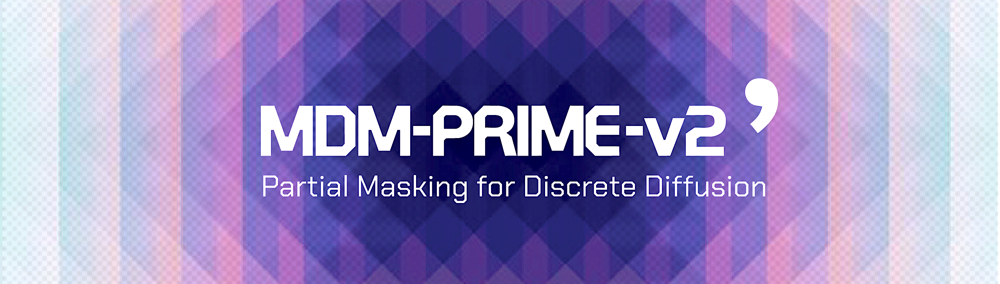

<div align="center">
<br>

</div>

<br>
<p align="center">
<a href="https://arxiv.org/abs/2603.16077"></a>
<a href="https://huggingface.co/collections/chen-hao-chao/mdm-prime"></a>
<a href="https://hub.docker.com/r/chenhaochao/mdm-prime-v2-megatron"></a>
<a href="https://hub.docker.com/r/chenhaochao/mdm-prime-v2-litgpt"></a>
<a href="https://x.com/chenhao_chao/status/2034647722947461489"></a><br>
</p>

## What’s Inside

This repository contains the code implementation of the experiments presented in the paper [*MDM-Prime-v2: Binary Encoding and Index Shuffling Enable Compute-optimal Scaling of Diffusion Language Models*](https://arxiv.org/abs/2603.16077).

- :whale: **Docker environments** for easy installation
- 🤗 **Pretrained weights** for inference and evaluation
- :chart_with_downwards_trend: **Weights and Biases logs** for enhanced reproducibility
- :microscope: **Code for all experiments** in our paper:
  - Scaling Analysis
  - Larger-scale Pretraining

## Overview

### Scaling Analysis
- **Folder**: [mdm-prime-v2/megatron](/megatron)
- **Dataset**: [allenai/c4](https://huggingface.co/datasets/allenai/c4)
- **Experiment**: Section 4.1 in our paper
- **Best for**: (1) Studying the loss behavior; (2) Pretraining with advanced parallelism

### Larger-scale Pretraining
- **Folder**: [mdm-prime-v2/lit_gpt](/lit_gpt)
- **Dataset**: [cerebras/SlimPajama-627B](https://huggingface.co/datasets/cerebras/SlimPajama-627B) (or [gmongaras/SlimPajama-627B_Reupload](https://huggingface.co/datasets/gmongaras/SlimPajama-627B_Reupload))
- **Experiment**: Section 4.3 in our paper
- **Best for**: (1) Pretraining 1.1B models; (2) Running inference and downstream applications

### PPL Benchmarking
- **Folder**: Refer to [chen-hao-chao/mdm-prime](https://github.com/chen-hao-chao/mdm-prime)
- **Dataset**: [Skylion007/openwebtext](https://huggingface.co/datasets/Skylion007/openwebtext)
- **Experiment**: Section 4.2 in our paper

## Demo

- Download our docker image and launch `gradio_demo.py`:
```bash
# Pull and launch the docker image
docker pull chenhaochao/mdm-prime-v2-litgpt:latest
docker run -v $(pwd):/workspace --rm -it --gpus all --ipc=host -p 3000:3000 chenhaochao/mdm-prime-v2-litgpt:latest

# Install gradio and run gradio_demo.py
uv pip install gradio
/venv/mdm-prime-v2-litgpt/bin/python gradio_demo.py
```

- Loading the model's weights takes a few minutes. After running the commands, the demo website will be available at `http://localhost:3000/`.


| <div align="center"></div> |
| --- |


## License
This code implementation is developed based on the following repositories.

- [ML-GSAI/SMDM](https://github.com/ML-GSAI/SMDM) (at commit `1df2e12`), licensed under the `Apache-2.0` license.
- [jzhang38/TinyLlama](https://github.com/jzhang38/TinyLlama) (at commit `bf12224`), licensed under the `Apache-2.0` license.
- [NVIDIA/Megatron-LM](https://github.com/NVIDIA/Megatron-LM) (at commit `636179d`), licensed under the `Apache-2.0` license.
- [wmn-231314/diffusion-data-constraint](https://github.com/wmn-231314/diffusion-data-constraint) (at commit `61002b2`), licensed under the `Apache-2.0` license.

Further changes based on the code in this folder are licensed under the `Apache-2.0` license.

## Citation

If you find this code implementation useful, please consider citing our papers.

```bib
@article{chao2026mdmprimev2,
      title = {{MDM-Prime-v2: Binary Encoding and Index Shuffling Enable Compute-optimal Scaling of Diffusion Language Models}}, 
      author = {Chen-Hao Chao, Wei-Fang Sun, Junwei Quan, Chun-Yi Lee, Rahul G. Krishnan},
      year = {2026},
}
@inproceedings{chao2025mdmprime,
      title = {{Beyond Masked and Unmasked: Discrete Diffusion Models via Partial Masking}}, 
      author = {Chen-Hao Chao, Wei-Fang Sun, Hanwen Liang, Chun-Yi Lee, Rahul G. Krishnan},
      booktitle = {Proceedings of the Conference on Neural Information Processing Systems (NeurIPS)},
      year = {2025},
}
```
