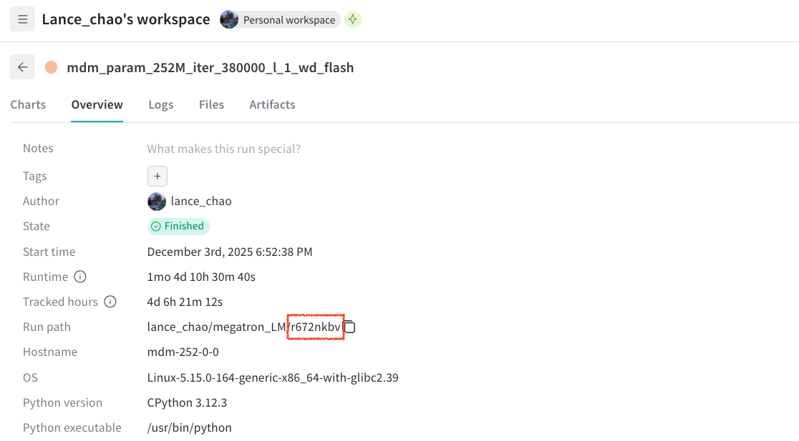
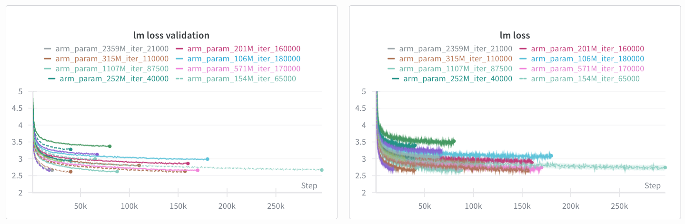

# Pretraining using Megatron-LM

<a href="https://arxiv.org/abs/2603.16077"></a>
<a href="https://huggingface.co/chen-hao-chao/mdm-prime-v2-c4"></a>
<a href="https://hub.docker.com/r/chenhaochao/mdm-prime-v2-megatron"></a>

This folder contains the code implementation of the scaling experiments presented in **Section 4.1** of [our paper](https://arxiv.org/abs/2603.16077). Our implementation is primarily based on [NVIDIA/Megatron-LM](https://github.com/NVIDIA/Megatron-LM).


## Install Dependencies

We recommend using [:whale: Docker](https://www.docker.com/) or [Apptainer](https://apptainer.org/) to build the environment for maximizing your GPU utilization. Lunch our pre-built docker image or build an image by yourself:

### Build an Image

1. Pull NVIDIA's base image `pytorch:25.04-py3` using the following command:
```bash
docker pull nvcr.io/nvidia/pytorch:25.04-py3
# or
apptainer pull docker://nvcr.io/nvidia/pytorch:25.04-py3
```

2. The image `pytorch_25.04-py3.sif` will be saved in your current directory. Launch it using the following command:
```bash
docker run -v $(pwd):/workspace --rm -it --gpus all --ipc=host nvcr.io/nvidia/pytorch:25.04-py3
# or
apptainer run --nv --bind "$(pwd)":/workspace --pwd /workspace pytorch_25.04-py3.sif
```

3. Install the following dependencies:
```bash
pip install megatron-core[lts]
pip install megatron-core[mlm]
pip install datasets
pip install wandb
pip install --upgrade huggingface_hub
pip install transformers -U
```

For more installation information, please refer to [NVIDIA/Megatron-LM](https://github.com/NVIDIA/Megatron-LM).


### Launch our Pre-built Image

1. Pull our pre-built docker image:
```bash
docker pull chenhaochao/mdm-prime-v2-megatron:latest
# or
apptainer pull mdm-prime-v2-megatron.sif docker://chenhaochao/mdm-prime-v2-megatron:latest
```

2. Launch the docker image at `mdm-prime-v2/megatron` through the following commands:
```bash
docker run -v $(pwd):/workspace --rm -it --gpus all --ipc=host chenhaochao/mdm-prime-v2-megatron:latest
# or
apptainer run --nv --bind "$(pwd)":/workspace --pwd /workspace mdm-prime-v2-megatron.sif
```

---

## Data Preparation

The dataset and the tokenizer will be downloaded through the 🤗 Huggingface APIs. Please first login to Huggingface via the following command:
```bash
hf auth login
```

1. **Download Raw Dataset**. Download the English split of [allenai/c4](https://huggingface.co/datasets/allenai/c4) and the GPT-2 tokenizer using the following command:
```bash
python dataset/download_ds.py
```
It may take a few hours to complete depending on your network connection speed.

2. **Convert the Data Format**. Megatron accepts `.jsonl` files for preprocessing. Convert the training shards into `.jsonl` files:
```bash
python dataset/convert_ds.py
```

3. **Data Preprocessing**. Concatenate the all the training and validation shards through the following commands. 
```bash
cat download/c4_jsonl/train/*.jsonl > download/c4_jsonl/train_all.jsonl
cat download/c4_jsonl/validation/*.jsonl > download/c4_jsonl/validation_all.jsonl
```
Please note that concatenation is optinal but it makes the follow-up training commands cleaner. You can skip this step by modifying the training commands to take multiple shards. Then, use Megatron-LM's preprocessing commands shown as follows  (this step requires `cuda`):
```bash
# Training split:
python tools/preprocess_data.py \
    --input download/c4_jsonl/train_all.jsonl \
    --output-prefix download/megatron_c4_en_train \
    --vocab-file download/tokenizer/gpt2_tok/vocab.json \
    --merge-file download/tokenizer/gpt2_tok/merges.txt \
    --tokenizer-type GPT2BPETokenizer \
    --json-key text \
    --append-eod \
    --workers 64

# Validation split:
python tools/preprocess_data.py \
    --input download/c4_jsonl/validation_all.jsonl \
    --output-prefix download/megatron_c4_en_val \
    --vocab-file download/tokenizer/gpt2_tok/vocab.json \
    --merge-file download/tokenizer/gpt2_tok/merges.txt \
    --tokenizer-type GPT2BPETokenizer \
    --append-eod \
    --workers 64
```
The above two steps may take a few hours to complete. Once the preprocessing step is completed, you can delete `download/c4_jsonl` and `download/c4_en_snapshot` if they take too much of space. The datasets that Megatron-LM uses for training will be stored at the `download` folder as follows:
```
download /
    ├── megatron_c4_en_train_text_document.idx
    ├── megatron_c4_en_train_text_document.bin
    ├── megatron_c4_en_val_text_document.idx
    └── megatron_c4_en_val_text_document.bin
```

---

## Commands

:pushpin: **Pretraining**

Use the following command to train ARM, MDM, and MDM-Prime-v2 in Megatron-LM:

```bash
torchrun $DISTRIBUTED_ARGS pretrain_{model_name}.py \
    $DATA_ARGS \
    $MODEL_ARGS \
    $OPTIM_ARGS \
    $PARALLEL_ARGS \
    $LOG_ARGS
```

Please refer to the [`scripts`](/megatron/scripts) folder for example training commands. A guideline to prompt these arguments is provided as follows (click to expand). 

<details>
<summary><strong>1. Hardware </strong> ($DISTRIBUTED_ARGS) </summary>

Adjust `GPUS_PER_NODE` according to the number of available GPUs:
```bash
export GPUS_PER_NODE=8
DISTRIBUTED_ARGS="--nproc_per_node=$GPUS_PER_NODE"
```
    
</details>

<details>
<summary><strong>2. Tokenizer & Data </strong> ($DATA_ARGS) </summary>

Specify the paths to your tokenizer and dataset. If you follow our data downlading instructions, the dataset and tokenizer will be saved at the `download` folder:
```bash
DATA_ARGS="
    --legacy-tokenizer \
    --tokenizer-type GPT2BPETokenizer \
    --vocab-size 50257 \
    --vocab-file download/tokenizer/gpt2_tok/vocab.json \
    --merge-file download/tokenizer/gpt2_tok/merges.txt \
    --train-data-path download/megatron_c4_en_train_text_document \
    --valid-data-path download/megatron_c4_en_val_text_document
"
```
 
</details>


<details>
<summary><strong>3. Model Architecture </strong> ($MODEL_ARGS) </summary>

Specify your model architecture. The following example uses a LLaMA-style architecture with 6 layers, 7 heads, hidden dimensionality 448, and sequence length 2048.
```bash
export NLAYERS=6 NHIDDEN=448 NHEADS=7
export FFN_SIZE=$((4 * NHIDDEN))
export SEQ=2048
MODEL_ARGS="
    --use-mcore-models \
    --num-layers $NLAYERS \
    --hidden-size $NHIDDEN \
    --ffn-hidden-size $FFN_SIZE \
    --num-attention-heads $NHEADS \
    --seq-length $SEQ \
    --max-position-embeddings $SEQ \
    --position-embedding-type rope \
    --use-rotary-position-embeddings \
    --swiglu \
    --normalization RMSNorm \
    --disable-bias-linear \
    --qk-layernorm \
    --untie-embeddings-and-output-weights
"
```
 
</details>


<details>
<summary><strong>4. Training & Optimization </strong> ($OPTIM_ARGS) </summary>

Specify the optimizator configuration. In this example, we use the adamW optimizer with global batch size 256 (`GBS`) and batch size 32 (`MICRO_BS`). The training lasts for 70000 iterations (`TRAIN_ITERS`). To minimize the runtime, please properly set `MICRO_BS` to maximize the GPU utilization.
```bash
export MICRO_BS=32 GBS=256 TRAIN_ITERS=70000
OPTIM_ARGS="
    --optimizer adam \
    --adam-beta1 0.9 \
    --adam-beta2 0.95 \
    --adam-eps 1e-8 \
    --weight-decay 0.1 \
    --lr 2e-4 \
    --min-lr 2e-5 \
    --lr-warmup-iters 1000 \
    --lr-decay-style cosine \
    --clip-grad 1.0 \
    --bf16 \
    --micro-batch-size $MICRO_BS \
    --global-batch-size $GBS \
    --train-iters $TRAIN_ITERS
"
```
 
</details>

<details>
<summary><strong>5. Parallelism & Performance </strong> ($PARALLEL_ARGS) </summary>

Specify how the training being parallelized and optimized (e.g., `flash-attn`, `distributed-optimizer`, ...). To minimize the runtime, please properly set `tensor-model-parallel-size` to maximize the GPU utilization.
```bash
PARALLEL_ARGS="
    --tensor-model-parallel-size 1 \
    --pipeline-model-parallel-size 1 \
    --use-flash-attn \
    --recompute-activations \
    --overlap-grad-reduce \
    --overlap-param-gather \
    --use-distributed-optimizer \
    --num-workers $GPUS_PER_NODE
"
```
 
</details>

<details>
<summary><strong>6. Logging & Checkpointing </strong> ($LOG_ARGS) </summary>

Specify the directories for storing the checkpoints and the Weight & Bias logging information:
```bash
export WANDB_API_KEY=${your_wandb_key}
export WANDB_PROJECT_NAM="Megatron-LM"
export VARIANT="mdm_param_14M"
LOG_ARGS="
    --save-interval 10000 \
    --eval-interval 1000 \
    --eval-iters 10 \
    --log-interval 10 \
    --save checkpoints/$VARIANT \
    --wandb-project $WANDB_PROJECT_NAME \
    --wandb-exp-name $VARIANT \
    --wandb-save-dir outputs/wandb_$VARIANT \
    --tensorboard-dir outputs/tensorboard_$VARIANT \
    --tensorboard-queue-size 5 \
    --log-timers-to-tensorboard \
    --log-validation-ppl-to-tensorboard
"
```
 
</details>

**Important Note:** The parallelism strategy heavily influences the total runtime. We suggest the users to optimize the configuration before training.

<br>

:pushpin: **Estimating Training FLOPs**

The total training FLOPs are determined by five variables in the scripts: `NLAYERS`, `NHIDDEN`, `GBS`, `TRAIN_ITERS`, and `SEQ`.

```bash
export NLAYERS=15 NHIDDEN=768
export GBS=256 TRAIN_ITERS=300000 SEQ=2048
```
```bash
python3 - <<'PY'
import os
L = int(os.environ["NLAYERS"])
d = int(os.environ["NHIDDEN"])
SEQ = int(os.environ.get("SEQ", 2048))
total_params = 12*d*d*L
print(f"---\nTotal non-embedding params (N): {total_params:,}  (~{total_params/1e9:.3f} B)")

gbs = os.environ.get("GBS")
iters = os.environ.get("TRAIN_ITERS")
GBS = int(gbs); I = int(iters)
D = GBS * SEQ * I
flops = 6 * total_params * D
print(f"Tokens processed (D):           {D:,}")
print(f"Training FLOPs (~6*N*D):        {flops:.3e}  (~{flops/1e18:.2f} EFLOPs)")
PY
```

This yields the following outputs:

```
Total non-embedding params (N): 106,168,320  (~0.106 B)
Tokens processed (D):           157,286,400,000
Training FLOPs (~6*N*D):        1.002e+20  (~100.19 EFLOPs)
```

<br>

:pushpin: **Resume Training from a Checkpoint**

Two additional variables to specify when resuming from a checkpoint: **(1) checkpoint path** and **(2) Weights & Biases run ID**. 

Please use the `--load` flag to indicate the checkpoint path. Megatron-LM will read the `latest_checkpointed_iteration.txt` file in the `checkpoints/$VARIANT` directory to determine which checkpoint to load. Modify that file if you do not want to load the latest checkpoint.

```bash
--load checkpoints/$VARIANT
```

If you are using `wandb`, remember to export your run ID (`WANDB_RUN_ID`) and (`WANDB_RESUME`) when resuming the run from a checkpoint. Megatron-LM will properly handle the current resuming step and avoid overwrite your running log.

```bash
export WANDB_RUN_ID="r672nkbv"
export WANDB_RESUME="allow"
```

To find the `WANDB_RUN_ID`, click `overview` in your Weight & Bias pannel, and it will appear in the `Run path` section:


|  |
| - |

---

## Implementation

### Training Scripts

The following files are modified to adapt the original [Megatron-LM](https://github.com/NVIDIA/Megatron-LM) code base to our training code:

- `pretrain_mask_diff.py` is based on `pretrain_gpt.py`
- `model_builders.py` is based on `gpt_builders.py`
- `megatron/core/models/bert/mask_diff_model.py` is based on `megatron/core/models/bert/bert_model.py`
- `megatron/training/arguments.py` is modified to include arguments for MDM-Prime-v2

### Subtokenizers

We make [subtokenizer](/megatron/subtokenizer) a separate package. MDM-Prime-v2 uses `BasebShufflingLayer`, which is a `torch.nn.Module` object that can encode (or decode) tokens into sub-tokens. Example usage ($b=2$, $\ell=16$):
```python
from subtokenizer.layers import BasebShufflingLayer

base = 2
target_length = 16 # token granularity in our paper
random_ratio = 1.0
subtokenizer = BasebShufflingLayer(base=base, target_length=target_length, perm=None, random_ratio=random_ratio)
```
The argument `perm` is a random permutation dictionary. The above example sets `perm=None` and `BasebShufflingLayer` will initiate a random permutation dictionary. If `perm=None`, remember to save `subtokenizer.perm` using `torch.save` to ensure reproducibility of the experiments.

In this code base, our pre-built permutation dictionary is automatically loaded by default: (Please refer to [mask_diff_model.py](/megatron/megatron/core/models/bert/mask_diff_model.py#L125-L128) Lines 125-128.)
```python
fname = f"subtokenizer/perm/perm_{random_ratio}_{base**target_length}.pt"
if os.path.exists(fname):
    perm = torch.load(fname, map_location="cpu")
```
The pre-built dictionaries are stored at [`subtokenizer/perm`](/megatron/subtokenizer/perm). Dictionaries with different index shuffling ratios (`random_ratio`) are available:
```
subtokenizer /
    └── perm /
        ├── perm_0.0_50625.pt
        ├── perm_0.0_65536.pt
        ├── perm_0.25_50625.pt
        ├── perm_0.25_65536.pt
        ├── perm_1.0_50625.pt
        └── perm_1.0_65536.pt
```
According to our empirical findings, the perplexity is robust against the random initialization. The performance of different runs with different permutation dictionaries should be comparable.

---


## Wandb Logs and Pretrained Weights

All training curves are available in our Weights & Biases project: [lance_chao/megatron-all-runs](https://wandb.ai/lance_chao/megatron-all-runs). Please refer to the instructions in the [plot](/plot) folder for reproducing Fig. 5 in [our paper](https://arxiv.org/abs/2603.16077) with these wandb logs.

|  |
| - |

We also release the weights (the last checkpoints). Please refer to our Huggingface release [🤗 Link](https://huggingface.co/chen-hao-chao/mdm-prime-v2-c4).


---

## License
This code implementation is developed based on the following repositories.

- [NVIDIA/Megatron-LM](https://github.com/NVIDIA/Megatron-LM) (at commit `636179d`), licensed under the `Apache-2.0` license.
- [wmn-231314/diffusion-data-constraint](https://github.com/wmn-231314/diffusion-data-constraint) (at commit `61002b2`), licensed under the `Apache-2.0` license.

Further changes based on the code in this folder are licensed under the `Apache-2.0` license.


---

## Citation

If you find this code implementation useful, please consider citing our paper.

```bib
@article{chao2026mdmprimev2,
      title = {{MDM-Prime-v2: Binary Encoding and Index Shuffling Enable Compute-optimal Scaling of Diffusion Language Models}}, 
      author = {Chen-Hao Chao, Wei-Fang Sun, Junwei Quan, Chun-Yi Lee, Rahul G. Krishnan},
      year = {2026},
}
@inproceedings{chao2025mdmprime,
      title = {{Beyond Masked and Unmasked: Discrete Diffusion Models via Partial Masking}}, 
      author = {Chen-Hao Chao, Wei-Fang Sun, Hanwen Liang, Chun-Yi Lee, Rahul G. Krishnan},
      booktitle = {Proceedings of the Conference on Neural Information Processing Systems (NeurIPS)},
      year = {2025},
}
```
