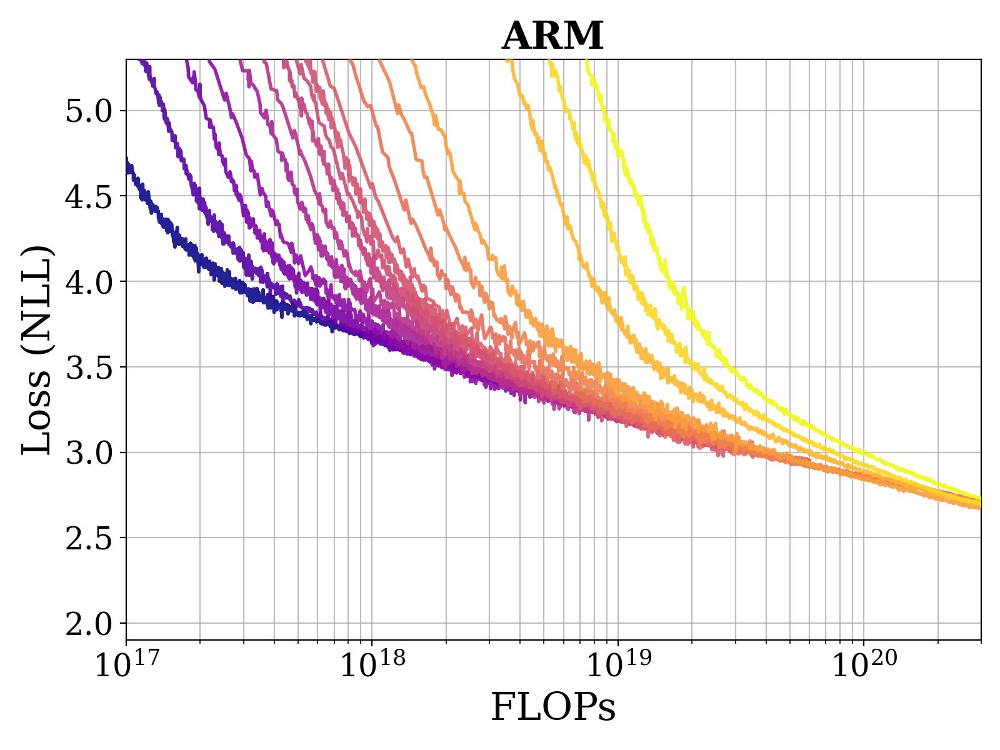
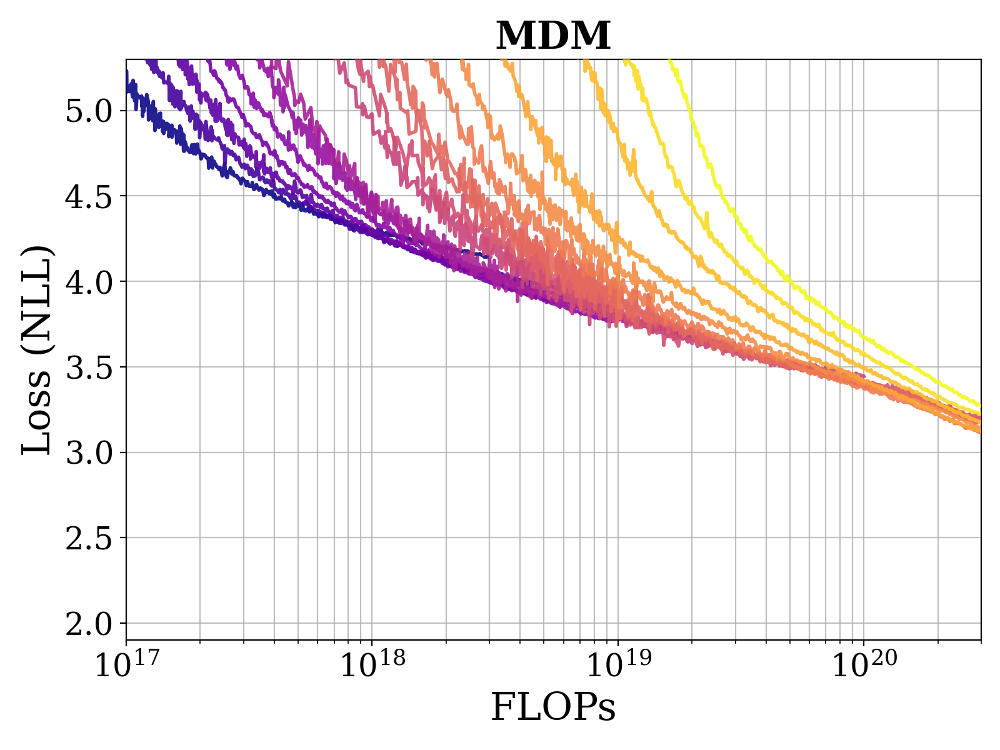
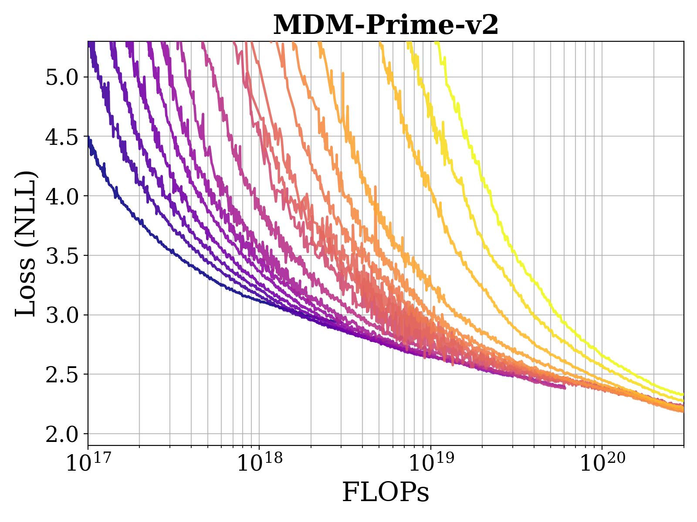
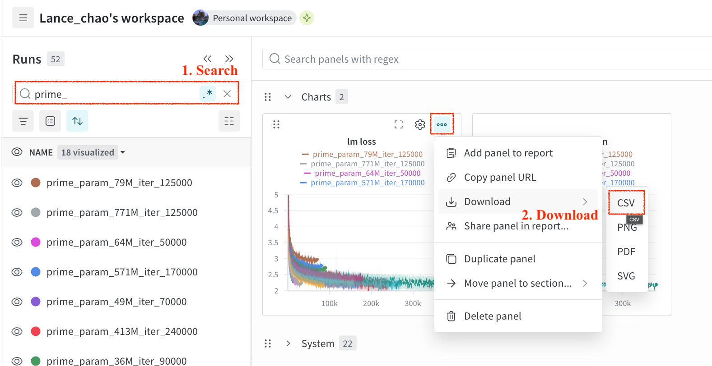
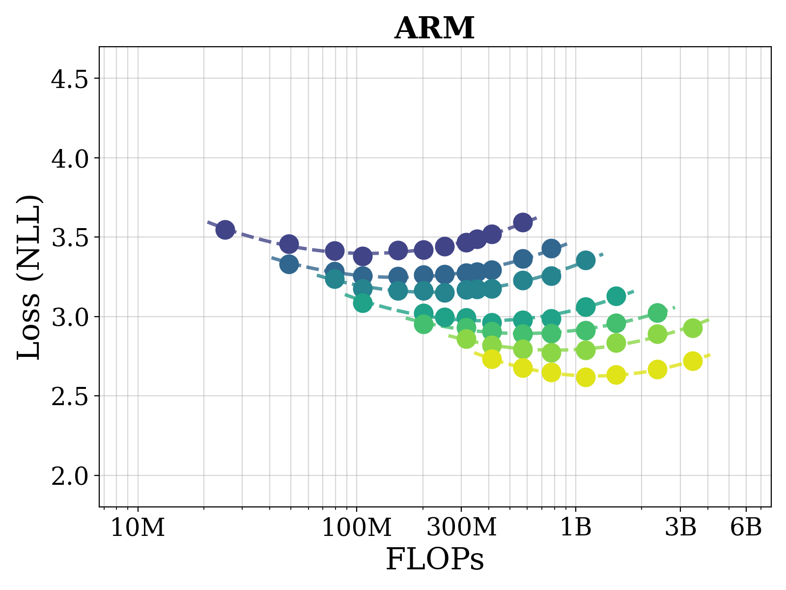
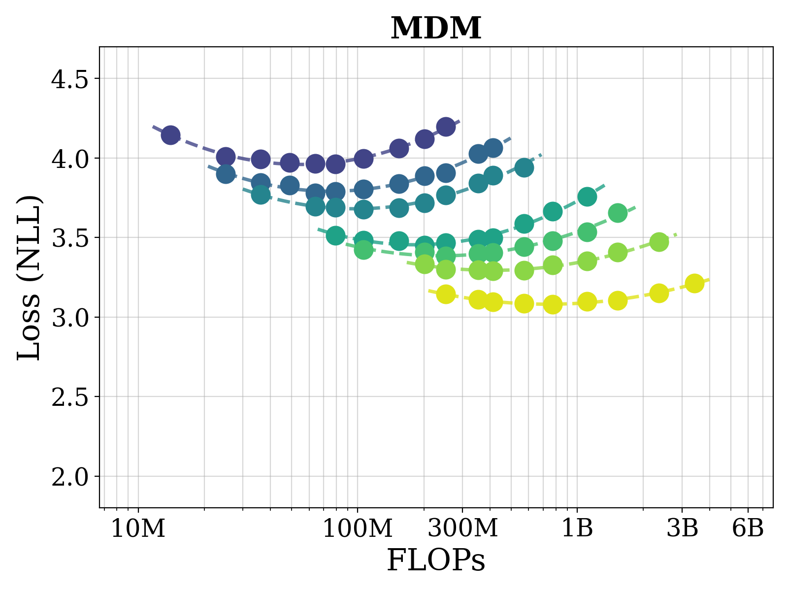
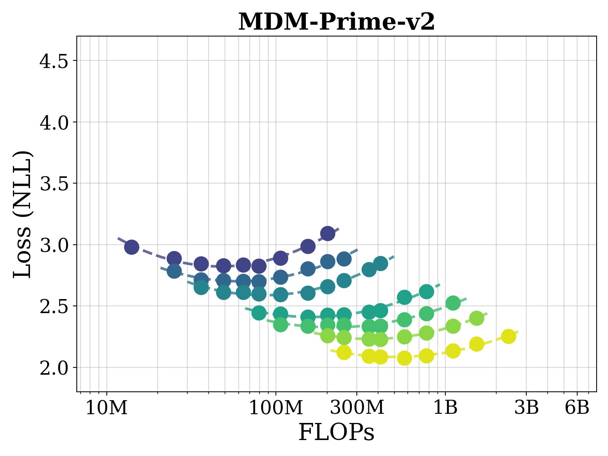
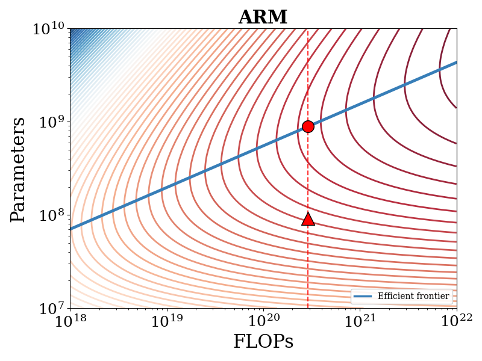
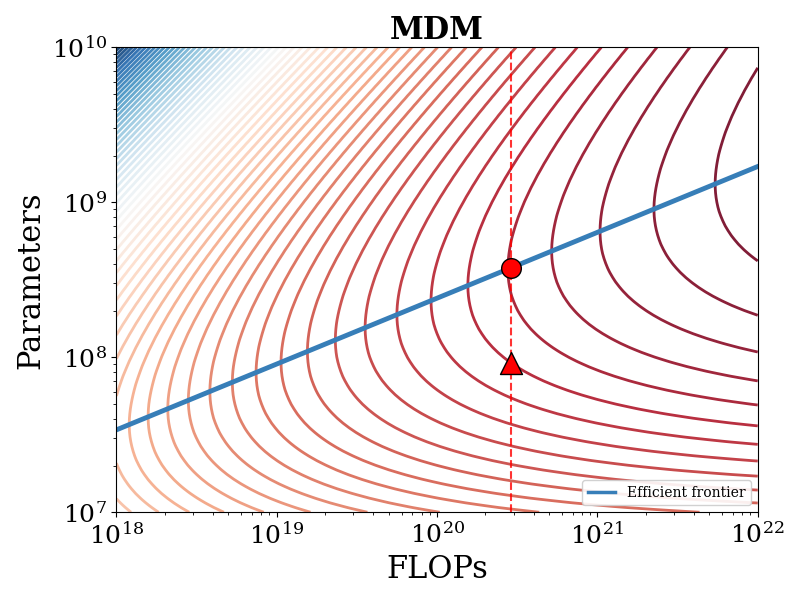
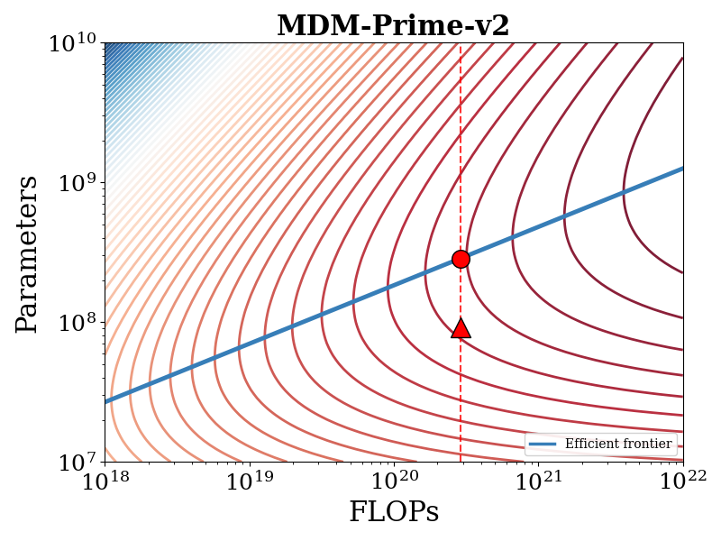

# Reproducing Figures in Our Paper

<a href="https://arxiv.org/abs/2505.18495"></a>

This folder contains the code implementation for plotting the figures presented in [our paper]().

---

## Install Dependencies

- We use [uv](https://github.com/astral-sh/uv) for installing the dependencies. Download it using:
```
curl -LsSf https://astral.sh/uv/install.sh | sh
```

- Create a virtual envrionment `mdm-prime-v2-plot`, and activate it:
```bash
uv venv --python=3.12 venv/mdm-prime-v2-plot
source venv/mdm-prime-v2-plot/bin/activate
```

- Install the following dependencices:
```bash
uv pip install numpy
uv pip install matplotlib
uv pip install pandas
uv pip install scipy
```

---

## Plot the Evaluation Results
We provide the code for plotting the following figures:

|   | Experiment  | Fig. # in the Paper   | Code        |
| -- | ---------- | --------------------- | ----------- |
| [[link :point_down:](#fig-5-a)] | Loss Envelopes             | Fig. 5 (a)        | [plot_loss_envelope.py](/plot/plot_loss_envelope.py) |
| [[link :point_down:](#fig-5-b)] | IsoFLOP Curves             | Fig. 5 (b)        | [plot_isoflop_curves.py](/plot/plot_isoflop_curves.py) |
| [[link :point_down:](#fig-5-c)] | IsoLoss Curves             | Fig. 5 (c)        | [plot_isoloss_curves.py](/plot/plot_isoloss_curves.py) |

---

### Fig. 5 (a)

- To plot the loss envelope curves, run the following command:
```bash
python plot_loss_envelope.py
```

- Enter `arm`, `mdm`, or `prime`. The code will plot the corresponding loss curve (it takes ~20 seconds). The plot will be saved as `envelope_${model_type}.png`.
```
Enter model type ('arm', 'mdm', or 'prime'): 
```

- You will get the following results:

|  |  |  |
| - | - | - |

- You can customize the plot to visualize the training curves from a Weights & Biases project. Take our W&B project [lance_chao/megatron-all-runs](https://wandb.ai/lance_chao/megatron-all-runs) for example. Select the runs to visualize and download them as a csv file:

|  |
| - |

- Rename these files and replace the `envelope_${model_type}.csv` files in the [`assets`](/megatron/plot/assets) folder. Then, rerun the `python plot_loss_envelope.py` command.

---

### Fig. 5 (b)

- To plot the IsoFLOP curves, run the following command:
```bash
python plot_isoflop_curves.py
```

- Enter `arm`, `mdm`, or `prime`. The code will plot the corresponding loss curve. The plot will be saved as `isoflop_${model_type}.png`.
```
Enter model type ('arm', 'mdm', or 'prime'): 
```

- You will get the following results:

|  |  |  |
| - | - | - |

- To customize the plot for other runs, change the lowest loss points specified in [plot_isoflop_curves.py](/plot/plot_isoflop_curves.py#L29-L35) in Lines 29-35:

```python
'losses': {
    "3e18": [3.547, 3.458, 3.413, 3.380, 3.416, 3.421, 3.443, 3.467, 3.488, 3.518, 3.594],
    "6e18": [3.332, 3.284, 3.257, 3.252, 3.264, 3.265, 3.274, 3.282, 3.292, 3.364, 3.430],
    "1e19": [3.238, 3.177, 3.162, 3.162, 3.152, 3.170, 3.173, 3.175, 3.228, 3.255, 3.355],
    "3e19": [3.087, 3.020, 2.997, 2.992, 2.963, 2.979, 2.987, 3.061, 3.13], 
    "6e19": [2.954, 2.930, 2.906, 2.891, 2.894, 2.912, 2.959, 3.025], 
    "1e20": [2.859, 2.821, 2.795, 2.772, 2.790, 2.835, 2.891, 2.927],
    "3e20": [2.734, 2.676, 2.649, 2.619, 2.634, 2.669, 2.720]
}
```

---

### Fig. 5 (c)

- To plot the IsoLoss curves, run the following command:
```bash
python plot_isoflop_loss.py
```

- Enter `arm`, `mdm`, or `prime`. The code will plot the corresponding loss curve. The plot will be saved as `isoloss_${model_type}.png`.
```
Enter model type ('arm', 'mdm', or 'prime'): 
```

- You will get the following results:

|  |  |  |
| - | - | - |

- The plot can be customized in a similar way as [Fig. 5 (b)](#fig-5-b).

---

## Citation

If you find this code implementation useful, please consider citing our papers.

```bib
@article{chao2026mdmprimev2,
      title = {{MDM-Prime-v2: Binary Encoding and Index Shuffling Enable Compute-optimal Scaling of Diffusion Language Models}}, 
      author = {Chen-Hao Chao, Wei-Fang Sun, Junwei Quan, Chun-Yi Lee, Rahul G. Krishnan},
      year = {2026},
}
@inproceedings{chao2025mdmprime,
      title = {{Beyond Masked and Unmasked: Discrete Diffusion Models via Partial Masking}}, 
      author = {Chen-Hao Chao, Wei-Fang Sun, Hanwen Liang, Chun-Yi Lee, Rahul G. Krishnan},
      booktitle = {Proceedings of the Conference on Neural Information Processing Systems (NeurIPS)},
      year = {2025},
}
```
